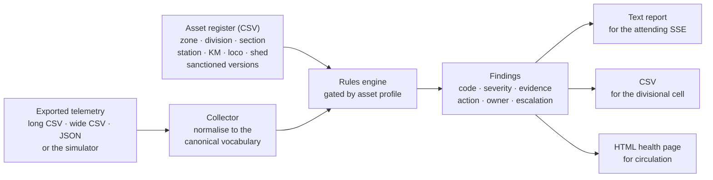

# Kavach Diagnostics

**Python · Indian Railways Kavach (TCAS) · Offline fault classification · OT security posture · Divisional reporting**

A diagnostic and health-reporting tool for **Kavach**, the Train Collision
Avoidance System deployed on Indian Railways.

It reads telemetry that Kavach installations have already recorded and
exported - station units, loco units, radio towers, interface units - and turns
it into **classified faults, engineering actions, escalation guidance and
divisional health reports**, in the vocabulary an S&T organisation already
works in: sections and station codes, kilometrage, loco numbers and sheds, the
failure register, and the divisional Kavach performance return.

## Read-only by design

Kavach is a SIL-4 train protection system. This tool is not part of it and must
not be relied on for train working.

```
  Safety system (SIL-4, RDSO approved, OEM supplied)
  └── produces logs, data-logger records, remote-monitoring exports
                    │  export (read only, offline, one way)
                    ▼
  kavach-diag  ── classify ── recommend ── report
```

* It **never** connects to, commands, or configures a Kavach unit.
* It reads exports only: data-logger extracts, NMS/remote-monitoring exports,
  maintenance terminal reports.
* Its output is a first-line diagnostic aid. It does not replace the prescribed
  maintenance schedule, the OEM handbook, or a site check.

The thresholds shipped in `kavach_diag/config.py` are working defaults, **not**
values taken from any RDSO specification or OEM handbook. Confirm every limit
against the applicable documents before field use.

## What it does

* **Register-driven scanning** across a whole section or division in one run -
  station units, loco units, towers and interface units together.
* **Asset profiles** so each unit type is assessed only against the checks that
  apply to it. A loco unit is never failed for having no interlocking
  interface.
* **Evidence-based fault classification** - 38 conditions across radio, RFID
  tags, location and odometry, the signalling interface, power supply, the
  onboard sub-system, software and track database, and OT security.
* **Engineering actions with ownership and escalation** - who attends, and how
  far the failure travels.
* **Correlated diagnosis** rather than raw alarms: a link that is down
  suppresses the signal-quality findings underneath it; authentication failures
  on a degraded radio path are reported as probable corruption, not as an
  attack.
* **OT security posture checks** mapped to EN 50159 threats and IEC 62443
  requirements, from evidence the units already record.
* **Reports** as text for the attending SSE, CSV for the divisional Kavach
  cell, and one self-contained HTML page for circulation.
* **A telemetry simulator**, so the tool can be developed, demonstrated and
  used for training without any operational data.

## Quick start

Python 3.10 or later. No third-party dependencies.

```bash
cd kavach-diagnostics

# What the tool can classify, and what it expects to be fed
python3 -m kavach_diag faults
python3 -m kavach_diag metrics

# Scan the sample register against sample telemetry
python3 -m kavach_diag scan \
    --inventory data/inventory/example_division_register.csv \
    --telemetry data/telemetry/section_scan_mixed.csv \
    --now "2026-09-08 06:00"

# Full reports for the same scan
python3 -m kavach_diag scan \
    --inventory data/inventory/example_division_register.csv \
    --telemetry data/telemetry/section_scan_mixed.csv \
    --format all --detail --out reports/

# One unit, in full
python3 -m kavach_diag scan \
    --inventory data/inventory/example_division_register.csv \
    --telemetry data/telemetry/loco_export_wide.csv \
    --asset LKU-40077 --detail

# Explain a fault code
python3 -m kavach_diag explain KVCH-TAG-003

# Generate telemetry when you have none
python3 -m kavach_diag simulate \
    --inventory data/inventory/example_division_register.csv \
    --out data/telemetry/today.csv --scenario degraded
```

`scan` exits `0` when nothing critical or major was found, `1` when something
needs attention, and `2` on an error - so it can be run from cron and used as a
gate.

## Example output

```text
====================================================================
KAVACH DIAGNOSTIC REPORT - LKU-40077
====================================================================

ASSET
--------------------------------------------------------------------
Unit type             : LKU
Kavach ID             : KV-L406
Location              : WDG-4 40077 (EXH)
Zone / Division       : EXZ / EXD
Telemetry as at       : 08-09-2026 05:31 IST

ASSESSMENT
--------------------------------------------------------------------
Overall               : CRITICAL
Diagnosis             : Unknown tag identity read - not in the track database

[1] CRITICAL - KVCH-TAG-003
    Unknown tag identity read - not in the track database
    Subsystem     : RFID / TRACK-SIDE TAGS
    Evidence      : unknown_tag_reads=1; last_tag_km=478/6; track_db_version=TDB-2024-11-R3
    Likely cause  : Tag laid but not entered in the track database, a tag recovered
                    from another section and re-used, a tag programmed with the wrong
                    identity, or an unauthorised tag placed in the track.
    Action        : Do not dismiss as a data entry error until the tag is physically
                    identified. Locate the tag by kilometrage, read its programmed
                    identity, and reconcile against the sanctioned track database.
    Responsibility: SSE/JE (S&T) - Kavach
    Escalation    : Advise Sr.DSTE and the zonal cyber security cell in addition to
                    the S&T failure register entry; joint check with P.Way.

[2] CRITICAL - KVCH-OBU-001
    Kavach isolated on the loco
    ...
```

And the divisional roll-up:

```text
====================================================================
SCAN SUMMARY
====================================================================

Assets assessed       : 20
CRITICAL              : 4
MAJOR                 : 4
OK                    : 12

REQUIRING ATTENTION
--------------------------------------------------------------------
CRITICAL  SKU-EXG      KVCH-SEC-005  Default or shared credentials in use
CRITICAL  RIU-EXB1     KVCH-SIG-003  Aspect mismatch between Kavach and signal
CRITICAL  LKU-30244    KVCH-SEC-006  Unsigned firmware present
CRITICAL  LKU-31108    KVCH-OBU-003  Brake interface fault
MAJOR     SKU-EXC      KVCH-SEC-003  Unknown peer units attempting to communicate
MAJOR     TWR-EXA1     KVCH-RAD-002  Weak radio signal (RSSI below working limit)
MAJOR     TWR-EXG1     KVCH-RAD-004  Radio frame loss above limit
MAJOR     LKU-31179    KVCH-OBU-002  Driver Machine Interface not healthy
```

## How it fits together



## Fault library

38 classifications, grouped by sub-system. Full detail with signatures,
causes, actions and escalation is in [docs/FAULT_LIBRARY.md](docs/FAULT_LIBRARY.md),
which is generated from the code so it cannot drift.

| Sub-system | Codes | Examples |
| --- | --- | --- |
| Radio | `KVCH-RAD-001..006` | Link down, weak RSSI, high VSWR, frame loss, off-channel operation, suspected interference |
| RFID track-side tags | `KVCH-TAG-001..003` | Tag read shortfall with kilometrage, CRC errors, unknown tag identity |
| Location & odometry | `KVCH-LOC-001..004` | Location error beyond tolerance, wheel slip, time reference lost, no GNSS fix |
| Signalling interface | `KVCH-SIG-001..003` | Interlocking link down, stale aspect telegrams, aspect mismatch |
| Power supply | `KVCH-PWR-001..004` | Mains failed, backup below reserve, charger not charging, DC out of range |
| Onboard / loco | `KVCH-OBU-001..005` | Kavach isolated, DMI fault, brake interface fault, SoS recorded, repeated interventions |
| Software & track database | `KVCH-CFG-001..003` | Track database mismatch, unsanctioned software version, configuration changed since commissioning |
| OT security | `KVCH-SEC-001..007` | Authentication failures, key expiry, unknown peers, open maintenance port, default credentials, unsigned firmware, removable media |
| Data availability | `KVCH-SYS-001..002` | Unit absent from the export, stale export |

## Documentation

| Document | What it covers |
| --- | --- |
| [docs/INDIAN_CONTEXT.md](docs/INDIAN_CONTEXT.md) | The safety boundary, the asset register, asset profiles, failure handling and escalation, and the conditions specific to how Kavach is worked here |
| [docs/DATA_SOURCES.md](docs/DATA_SOURCES.md) | Accepted file shapes, the canonical metric vocabulary, and how to write an OEM adapter |
| [docs/SECURITY_MODEL.md](docs/SECURITY_MODEL.md) | EN 50159 threats and IEC 62443 requirements mapped to the checks, and what the checks are not |
| [docs/FAULT_LIBRARY.md](docs/FAULT_LIBRARY.md) | Every classification in full (generated) |

## Project structure

```text
kavach-diagnostics
├── kavach_diag/
│   ├── model.py            Asset, Snapshot, Finding, Severity
│   ├── config.py           thresholds and per-asset-type check profiles
│   ├── faults.py           the fault library - one definition per condition
│   ├── inventory.py        the divisional asset register
│   ├── report.py           text, CSV and HTML reporting
│   ├── cli.py              scan / explain / faults / metrics / simulate
│   ├── collectors/         base vocabulary, file collector, simulator
│   └── rules/              engine + radio, rfid, location, signalling,
│                           power, onboard, config, security
├── data/
│   ├── inventory/          example asset register (illustrative, not real)
│   └── telemetry/          sample exports in all three shapes
├── docs/
├── tests/                  65 tests, standard library only
└── tools/                  fault library generator
```

## Tests

```bash
cd kavach-diagnostics
python3 -m unittest discover -s tests -v
```

## Extending it

* **A new fault**: add a `FaultDefinition` in `kavach_diag/faults.py`, write the
  rule in the matching module under `kavach_diag/rules/`, add a test, and run
  `python3 tools/generate_fault_library.py`.
* **A new OEM export**: write a `Collector` that maps that export onto the
  canonical vocabulary. No rule changes - see `docs/DATA_SOURCES.md`.
* **Division-specific limits**: pass `--thresholds limits.json` with the values
  confirmed against your instructions.
* **Division-specific escalation**: edit the `responsibility` and `escalation`
  text in `faults.py` to match your JPO.

## Where it could go

* Historical trending: repeated tag misses at the same kilometrage, RSSI
  degradation over months, sections with recurring interventions.
* Coverage analysis from RSSI against kilometrage, to separate a unit fault
  from a genuine coverage gap.
* Scheduled daily scans with the summary published to the divisional Kavach
  cell.
* A track-database reconciliation check between the sanctioned tag list and
  what locos actually read over a section.

## Disclaimer

This is an independent engineering and analysis tool. It is not an RDSO or OEM
product, carries no safety approval, and is not certified for any safety
function. All sample data in this repository is simulated; the zone, division,
station, loco and OEM identifiers in it are illustrative and do not represent
any actual installation.
